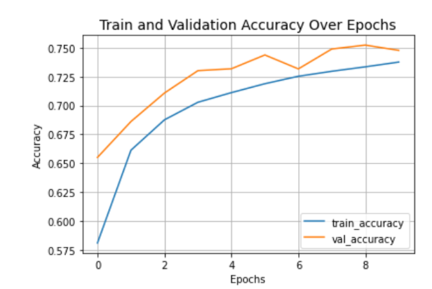
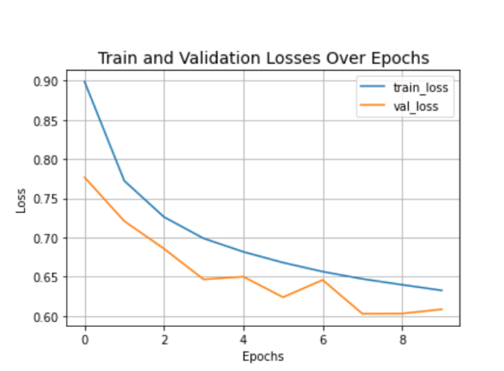
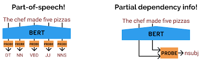

# SNLI

* dataset - https://nlp.stanford.edu/projects/snli/
* Extracted training, validation and testing data from SNLI dataset to carry out inference task
* Used BiLSTM architecture 

* Got training accuracy of 76.3 and validation accuracy of 75.57 

* Next I carried out POS tag probing 
* We probe on a model representation from the previous tasks i.e a specific frozen
layer of the model and we start building the model from this layer. We take the 4th
layer from last and add it to a keras.Sequential function.
* We then add an RNN layer with 2 cells with returns sequences to the next layer
* We see a significant increase in the validation accuracy due to the fact that the
Bi-LSTM model is able to interpret the POS tags. To address the probe
confounder problem, it may seem that due to the complexity of RNN as compared
to MLP, the model may be memorizing the outputs from the probed layer with
some supervision. But, in fact, the learned parameters of the probe is low of ~800
parameters only. In literature shallow MLPs are preferred which will be a part of
future work. Literature also uses ‘selectivity’ as a metric for the performance of
the probe, selectivity = linguistic accuracy - control accuracy

